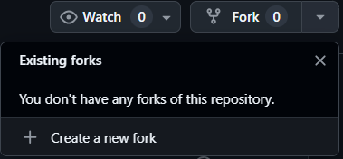
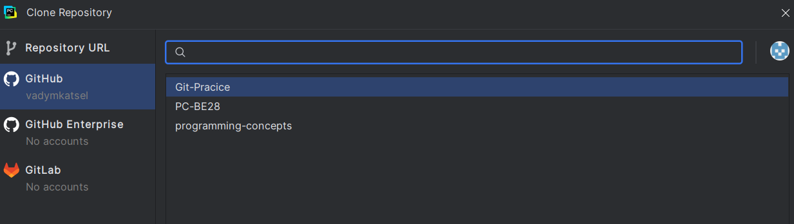
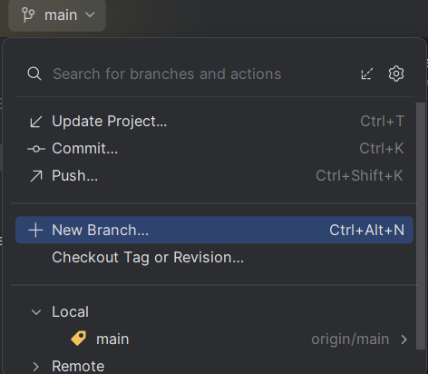
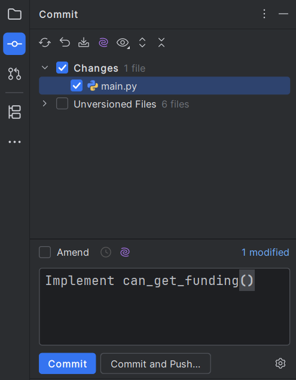
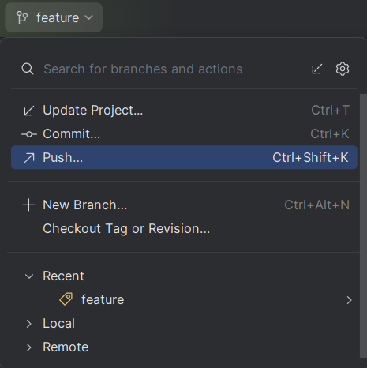
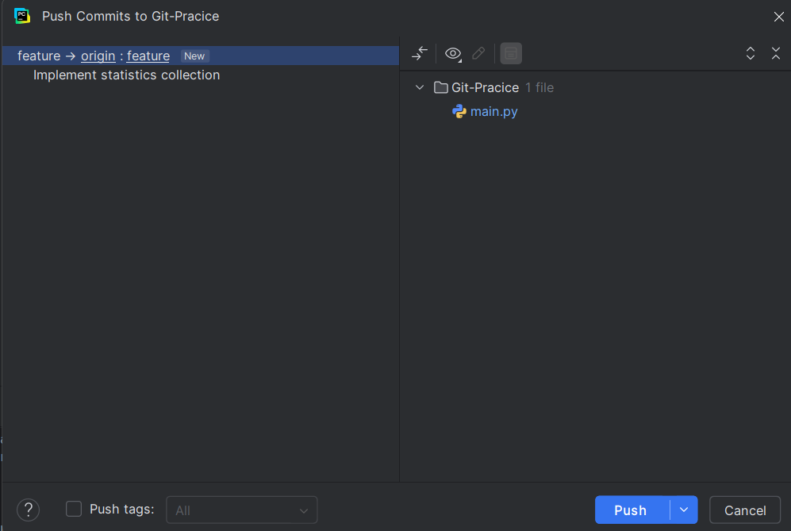
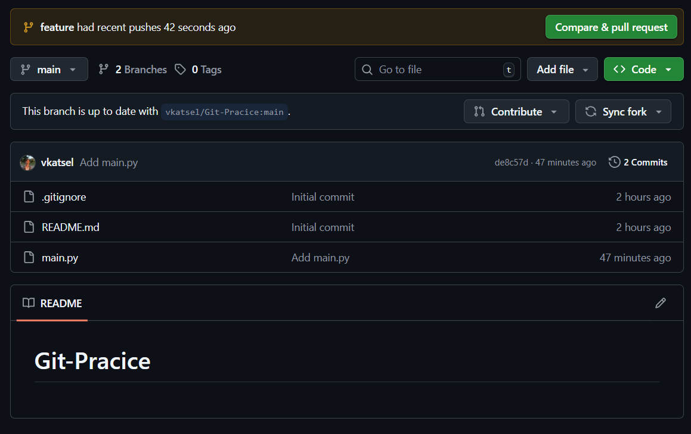
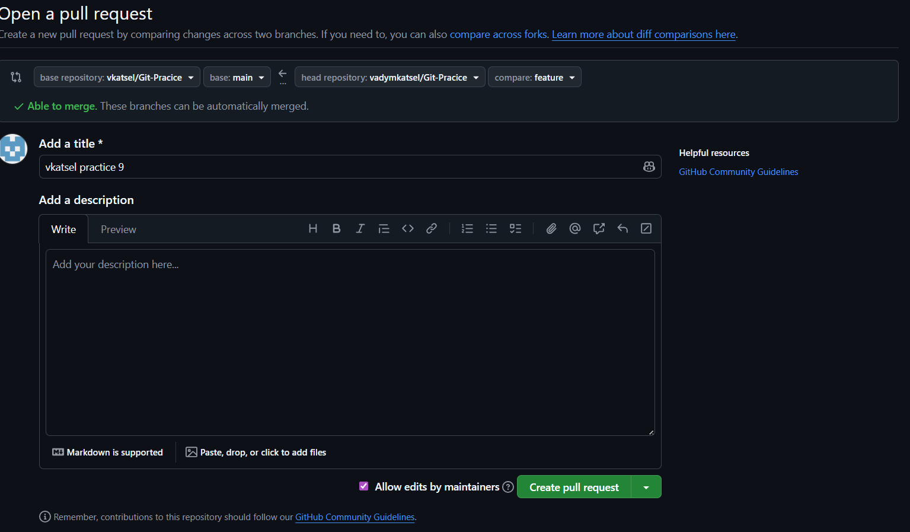

# <i class="fa-duotone fa-brands fa-git-alt"></i>  Основи роботи з Git

Під час сьогоднішнього воркшопу ви зможете на практиці познайомитися з такими інструментами як Git та GitHub. Ці інструменти є стандартом для індустрії в сфері контролю версій та дозволяють гнучко налаштувати спільну роботу багатьох людей над проєктом одночасно. 

**Git** — це система контролю версій, яка дозволяє ефективно керувати та відслідковувати зміни у вашому проєкті.

**GitHub** — це платформа, розроблена для того, аби викладати ваші проєкти до глобальної мережі та надати можливість легко працювати над проєктами з іншими.

## 📝 Cheat Sheet

- Repository (Репозиторій): Папка з вашим проєктом, яка має суперсилу — запам'ятовувати всю історію змін кожного файлу. Буває локальним (на вашому комп'ютері) та віддаленим (на сервері GitHub).

- Commit (Коміт): Фіксація або "знімок" стану вашого коду в конкретний момент. У PyCharm це робиться через панель Commit. Ви позначаєте галочками файли, обов'язково пишете повідомлення (що саме змінили) і зберігаєте. Коміт зберігає зміни лише на вашому комп'ютері.

- Push (Пуш): Відправка ваших локальних комітів на віддалений сервер. Поки ви не зробите push (зелена стрілочка вгору↗ в PyCharm), ніхто у світі ваших змін не побачить.

- Pull (Пул): Завантаження нових змін із віддаленого сервера на ваш комп'ютер (синя стрілочка вниз↙ в PyCharm). Це оновлює ваш локальний код до найсвіжішої версії.

- Fork (Форк): Ваша особиста копія чужого репозиторію. Робиться не в PyCharm, а прямо на сайті GitHub. Дозволяє вільно експериментувати з кодом, не ризикуючи зламати оригінальний проєкт викладача чи колеги.

- Branch (Гілка): Ізольована копія коду всередині репозиторію. Ви ніби відгалужуєтесь від головної гілки (main), безпечно пишете свою функцію, а потім зливаєте її назад. Керування гілками у PyCharm зазвичай знаходиться в самому правому нижньому куті вікна.

- Merge Conflict (Конфлікт злиття): Ситуація, коли дві людини одночасно змінили один і той самий рядок у файлі, і Git не знає, чий варіант правильний. PyCharm має зручне вікно "Resolve Conflicts" із трьома колонками: зліва — ваш код, справа — код з сервера, по центру — фінальний результат, який ви збираєте вручну.

- Pull Request (PR): Запит на сайті GitHub, у якому ви просите власника оригінального репозиторію перевірити ваш код і додати його до головного проєкту.

## 🔎 Експерименти з GitHub та Git

Сьогодні ми симулюємо реальний процес командної розробки. Ваше завдання — написати логіку для визначення того, чи отримає студент фінансування на основі його оцінок. 

Але робота програміста рідко буває ізольованою. Поки ви будете писати свій код, адміністрація оновить списки студентів в головному репозиторії. Вам доведеться не лише написати працюючий код, але й навчитися синхронізувати свою локальну версію з оновленнями колег та розв'язувати конфлікти версій.

### <i class="fa-duotone fa-solid fa-code-fork"></i> Fork

Перш ніж починати роботу над проєктом, нам потрібен сам репозиторій, в якому ми будемо працювати. Для того, аби отримати доступ до головного репозиторію вам потрібно зробити `Fork` — операцію, яка надає вам власну копію репозиторію на платформі GitHub.

Перш за все, перейдіть за посиланням на [головний репозиторій](https://github.com/vkatsel/Git-Pracice)

Після цього, натисність на кнопку Fork у верхній частині екрану

Перед Вами з'явиться меню конфігурації репозиторію. Натисніть кнопку `Fork`, і магія - ви маєте власну копію головного репозиторію!

### <i class="fa-duotone fa-solid fa-clone"></i> Clone

Тепер, коли в нас є власна копія репозиторію, нам потрібно якось з ним працювати. Поки вона є тільки на GitHub ми не можемо прямо писати внеї код та працювати повноцінно.

Для того, аби репозиторій також був на вашому комп'ютері, нам потрібно зробити операцію `git clone`, яка створить **локальну копію** репозиторію. 

### <i class="fa-duotone fa-solid fa-code-branch"></i> Branching

І тепер, коли ми нарешті маємо наш проєкт в IDE, правилом хорошого тону є створення окремої *гілки* для імплементації нових функцій програми.

Для цього створімо гілку "gpa-calculation"

### <i class="fa-duotone fa-solid fa-code"></i> Implement

І найцікавіше - ваше головне завдання. Оскільки ви долучилися до університетської IT команди, вашою першою задачею стала розробка алгоритму для визначення чи може певний студент отримати фінансування. Для цього вам потрібно імплементувати функцію `сan_get_funding()`, яка приймає список з оцінками студента.

Студент, що отримує фінансування, має відповідати наступним умовам:
- GPA > 80
- Немає оцінок менше за 60

Функція має повертати `True` або `False` в залежності від оцінок студента

**Вхідні дані:** Двовимірний список з оцінками студентів `students_grades`

Кожен вкладений список відповідає одному студенту. Елементи вкладеного списку — це цілі числа від 0 до 100.

**Вихідні дані:** Значення `True ` або `False`

### <i class="fa-duotone fa-solid fa-code-commit"></i> Commit

Після цього, аби зафіксувати вашу роботу, вам потрібно зробити коміт - знімок стану вашого файлу з кодом. Це зафіксує зміни, які ви внесли в історії гіта, як певну точку, з якою потім можна буде взаємодіяти.

Для цього, відкрийте бокове меню налаштування коміту, оберіть файли, які хочете додати, та напишіть змістовне повідомлення про виконану роботу. Наприклад:

### <i class="fa-duotone fa-solid fa-repeat"></i> Repeat!

І от перед вами одразу ж постає наступна задача. На тій же гілці, реалізуйте в `main.py` просте обрахування статистики оцінок студентів. Вам потрібно вивести на екран наступну інформацію: 

- Скільки студентів отримали фінансування
- Який середній GPA у всіх студентів
- Який середній GPA у тих студентів, що отримали фінансування

::: {.callout-tip}
# Порада
Скористайтеся функцією, написаною раніше аби визначити чи отримає студент фінансування і використайте цикл `for`, аби порахувати статистичні дані.
:::

Після цього, зробіть ще один коміт, аби закріпити вашу роботу

### <i class="fa-duotone fa-solid fa-upload"></i> Git Push and PR

І ось, нарешті, настав той момент, коли всі задачі виконані. Але от халепа! Ви перевіряєте свій GitHub, і розумієте, що там немає ані вашої гілки, ані вашого написаного коду.

Для того, аби виправити це неподобство, вам потрібно зробити `Push` - операцію, яка надсилає зміни з вашого локального репозиторію до віддаленго (того, що знаходиться на серверах GitHub)

Для цього, після того як ви зробили коміт оберіть Push та необхідну гілку в інтерфейсі Pycharm 

Коли ви переконаєтеся, що у вашому віддаленому репозиторії з'явилися зміни, вам також потрібно надіслати `Pull Request` для того, аби запропонувати додати зміни в головний репозиторій.

На цьому етапі ви освоїли базовий алгоритм командної роботи над проєктом, з чим Вас можна привітати!

Цей алгоритм може варіюватися та змінюватися в залежності від поставлених задач та контексту, але він визначає основу командної роботи над проєктом.
